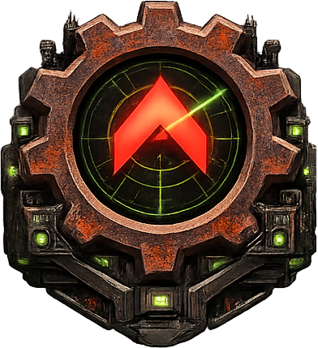

# Iron Curtain — Design Documentation

<p align="center">
  
</p>

## Project: Rust-Native RTS Engine

**Status:** Pre-development (design phase)  
**Date:** 2026-02-19  
**Codename:** Iron Curtain  
**Author:** David Krasnitsky  

## What This Is

A Rust-native RTS engine that supports OpenRA resource formats (`.mix`, `.shp`, `.pal`, YAML rules) and reimagines internals with modern architecture. Not a clone or port — a complementary project offering different tradeoffs (performance, modding, portability) with full OpenRA mod compatibility as the zero-cost migration path. OpenRA is an excellent project; IC explores what a clean-sheet Rust design can offer the same community.

## Document Index

| #   | Document                           | Purpose                                                                                                                                                               | Read When...                                                                                                                           |
| --- | ---------------------------------- | --------------------------------------------------------------------------------------------------------------------------------------------------------------------- | -------------------------------------------------------------------------------------------------------------------------------------- |
| 01  | `01-VISION.md`                     | Project goals, competitive landscape, why this should exist                                                                                                           | You need to understand the project's purpose and market position                                                                       |
| 02  | `02-ARCHITECTURE.md`               | Core architecture: crate structure, ECS, sim/render split, game loop, install & source layout, RA experience recreation, first runnable plan, SDK/editor architecture | You need to make any structural or code-level decision                                                                                 |
| 02+ | `architecture/gameplay-systems.md` | Extended gameplay systems (RA1 module): power, construction, production, harvesting, combat, fog, shroud, crates, veterancy, superweapons                             | You're implementing or reviewing a specific RA1 gameplay system                                                                        |
| 03  | `03-NETCODE.md`                    | Unified relay lockstep netcode, sub-tick ordering, adaptive run-ahead, NetworkModel trait                                                                             | You're working on multiplayer, networking, or the sim/network boundary                                                                 |
| 03+ | `netcode/match-lifecycle.md`       | Match lifecycle: lobby, loading, tick processing, pause, disconnect, desync, replay, post-game                                                                        | You're tracing the operational flow of a multiplayer match                                                                             |
| 04  | `04-MODDING.md`                    | YAML rules, Lua scripting, WASM modules, templating, resource packs, mod SDK                                                                                          | You're working on data formats, scripting, or mod support                                                                              |
| 04+ | `modding/campaigns.md`             | Campaign system: branching graphs, persistent state, unit carryover, co-op                                                                                            | You're designing or implementing campaign missions and branching logic                                                                 |
| 04+ | `modding/workshop.md`              | Workshop: federated registry, P2P distribution, semver deps, modpacks, moderation, creator reputation, Workshop API                                                   | You're working on content distribution, Workshop features, mod publishing, or creator tools                                            |
| 05  | `05-FORMATS.md`                    | File formats, original source code insights, compatibility layer                                                                                                      | You're working on asset loading, ra-formats crate, or OpenRA interop                                                                   |
| 06  | `06-SECURITY.md`                   | Threat model, vulnerabilities, mitigations for online play                                                                                                            | You're working on networking, modding sandbox, or anti-cheat                                                                           |
| 07  | `07-CROSS-ENGINE.md`               | Cross-engine compatibility, protocol adapters, reconciliation                                                                                                         | You're exploring OpenRA interop or multi-engine play                                                                                   |
| 08  | `08-ROADMAP.md`                    | 36-month development plan with phased milestones                                                                                                                      | You need to plan work or understand phase dependencies                                                                                 |
| 09  | `09-DECISIONS.md`                  | Decision index — links to 7 thematic sub-documents covering all 76 decisions                                                                                          | You need to find which sub-document contains a specific decision                                                                       |
| 09a | `decisions/09a-foundation.md`      | Decisions: language, framework, data formats, simulation invariants, core engine identity, crate extraction                                                           | You're questioning or extending a core engine decision (D001–D003, D009, D010, D015, D017, D018, D039, D063, D064, D067, D076)         |
| 09b | `decisions/09b-networking.md`      | Decisions: network model, relay server, sub-tick ordering, community servers, ranked play, community server bundle                                                    | You're working on networking or multiplayer decisions (D006–D008, D011, D012, D052, D055, D060, D074)                                  |
| 09c | `decisions/09c-modding.md`         | Decisions: scripting tiers, OpenRA compatibility, UI themes, mod profiles, licensing, export, selective install, Remastered format compat                             | You're working on modding, theming, or compatibility decisions (D004, D005, D014, D023–D027, D032, D050, D051, D062, D066, D068, D075) |
| 09d | `decisions/09d-gameplay.md`        | Decisions: pathfinding, balance, QoL, AI systems, render modes, trait-abstracted subsystems, asymmetric co-op, LLM exhibition modes                                   | You're working on gameplay mechanics or AI decisions (D013, D019, D021, D022, D028, D029, D033, D041–D045, D048, D054, D070, D073)     |
| 09e | `decisions/09e-community.md`       | Decisions: Workshop, telemetry, SQLite, achievements, governance, premium content, profiles, data portability                                                         | You're working on community platform or infrastructure decisions (D030, D031, D034–D037, D046, D049, D053, D061)                       |
| 09f | `decisions/09f-tools.md`           | Decisions: LLM missions, scenario editor, asset studio, mod SDK, LLM config, foreign replay, skill library                                                            | You're working on tools, editor, or LLM decisions (D016, D020, D038, D040, D047, D056, D057)                                           |
| 09g | `decisions/09g-interaction.md`     | Decisions: command console, communication (chat, voice, pings), tutorial/new player experience, installation setup wizard                                             | You're working on in-game interaction systems (D058, D059, D065, D069)                                                                 |
| 10  | `10-PERFORMANCE.md`                | Efficiency-first performance philosophy, targets, profiling                                                                                                           | You're optimizing a system, choosing algorithms, or adding parallelism                                                                 |
| 11  | `11-OPENRA-FEATURES.md`            | OpenRA feature catalog (~700 traits), gap analysis, migration mapping                                                                                                 | You're assessing feature parity or planning which systems to build next                                                                |
| 12  | `12-MOD-MIGRATION.md`              | Combined Arms mod migration, Remastered recreation feasibility                                                                                                        | You're validating modding architecture against real-world mods                                                                         |
| 13  | `13-PHILOSOPHY.md`                 | Development philosophy, game design principles, design review, lessons from C&C creators and OpenRA                                                                   | You're reviewing design/code, evaluating a feature, or resolving a design tension                                                      |
| 14  | `14-METHODOLOGY.md`                | Development methodology: stages from research through release, context-bounded work units, research rigor & AI-assisted design process, agent coding guidelines       | You're planning work, starting a new phase, understanding the research process, or onboarding as a new contributor                     |
| 15  | `15-SERVER-GUIDE.md`               | Server administration guide: configuration reference, deployment profiles, best practices for tournament organizers, community admins, and league operators           | You're setting up a relay server, running a tournament, or tuning parameters for a community deployment                                |
| 16  | `16-CODING-STANDARDS.md`           | Coding standards: file structure, commenting philosophy, naming conventions, error handling, testing patterns, code review checklist                                  | You're writing code, reviewing a PR, onboarding as a contributor, or want to understand the project's code style                       |
| 17  | `17-PLAYER-FLOW.md`                | Player flow & UI navigation: every screen, menu, overlay, and navigation path from first launch through gameplay, UX principles, platform adaptations                 | You're designing UI, implementing a screen, tracing how a player reaches a feature, or evaluating the UX                               |

**LLM feature overview (optional / experimental):** See [Experimental LLM Modes & Plans](LLM-MODES.md) for a consolidated overview of planned LLM gameplay modes, creator tooling, and external-tool integrations. The project is fully designed to work without any LLM configured.

## Key Architectural Invariants

These are non-negotiable across the entire project:

1. **Simulation is pure and deterministic.** No I/O, no floats, no network awareness. Takes orders, produces state. Period.
2. **Network model is pluggable via trait.** `GameLoop<N: NetworkModel, I: InputSource>` is generic over both network model and input source. The sim has zero imports from `ic-net`. They share only `ic-protocol`. Within the lockstep family (all shipping implementations), swapping network backends touches zero sim code. Non-lockstep architectures (rollback, FogAuth) would also leave `ic-sim` untouched but may require game loop extension in `ic-game`.
3. **Modding is tiered.** YAML (data) → Lua (scripting) → WASM (power). Each tier is optional and sandboxed.
4. **Bevy as framework.** ECS scheduling, rendering, asset pipeline, audio — Bevy handles infrastructure so we focus on game logic. Custom render passes and SIMD only where profiling justifies it.
5. **Efficiency-first performance.** Better algorithms, cache-friendly ECS, zero-allocation hot paths, simulation LOD, amortized work — THEN multi-core as a bonus layer. A 2-core laptop must run 500 units smoothly.
6. **Real YAML, not MiniYAML.** Standard `serde_yaml` with inheritance resolved at load time.
7. **OpenRA compatibility is at the data/community layer, not the simulation layer.** Same mods, same maps, shared server browser — but not bit-identical simulation.
8. **Full resource compatibility with Red Alert and OpenRA.** Every .mix, .shp, .pal, .aud, .oramap, and YAML rule file from the original game and OpenRA must load correctly. This is non-negotiable — the community's existing work is sacred.
9. **Engine core is game-agnostic.** No game-specific enums, resource types, or unit categories in engine core. Positions are 3D (`WorldPos { x, y, z }`). System pipeline is registered per game module, not hardcoded.
10. **Platform-agnostic by design.** Input is abstracted behind `InputSource` trait. UI layout is responsive (adapts to screen size via `ScreenClass`). No raw `std::fs` — all assets go through Bevy's asset system. Render quality is runtime-configurable.

## Crate Structure Overview

```
iron-curtain/
├── ra-formats     # .mix, .shp, .pal, YAML parsing, MiniYAML converter (C&C-specific, keeps ra- prefix)
├── ic-protocol    # PlayerOrder, TimestampedOrder, OrderCodec trait (SHARED boundary)
├── ic-sim         # Deterministic simulation (Bevy FixedUpdate systems)
├── ic-net         # NetworkModel trait + implementations; RelayCore library (no ic-sim dependency)
├── ic-render      # Isometric rendering, shaders, post-FX (Bevy plugin)
├── ic-ui          # Game chrome: sidebar, minimap, build queue (Bevy UI)
├── ic-editor      # SDK: scenario editor, asset studio, campaign editor, Game Master mode (D038+D040, Bevy app)
├── ic-audio       # .aud playback, EVA, music (Bevy audio plugin)
├── ic-script      # Lua + WASM mod runtimes
├── ic-ai          # Skirmish AI, mission scripting, LLM-enhanced AI strategies (depends on ic-llm)
├── ic-llm         # LlmProvider trait, prompt infra, skill library, Tier 1 CPU inference (traits + infra only — no ic-sim)
├── ic-paths       # Platform path resolution: data dirs, portable mode, credential store
├── ic-game        # Top-level Bevy App, ties all game plugins together (NO editor code)
└── ic-server      # Unified server binary (D074): depends on ic-net (RelayCore) + optionally ic-sim (for FogAuth/relay-headless deployments)
```

## License

All files in `src/` and `research/` are licensed under [CC BY-SA 4.0](https://creativecommons.org/licenses/by-sa/4.0/). Engine source code is licensed under [GPL v3](https://www.gnu.org/licenses/gpl-3.0.html) with an explicit modding exception (D051).

## Trademarks

Red Alert, Tiberian Dawn, Command & Conquer, and C&C are trademarks of Electronic Arts Inc. Iron Curtain is not affiliated with, endorsed by, or sponsored by Electronic Arts.
